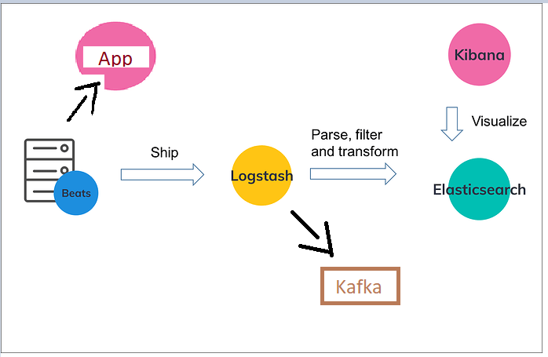

# Analyzing logs using Kafka
# Real-time Processing of Logs
# Using ELK Stack with Kafka : Kubernetes

A Logging implementation using ELKK Stack

* Elastic Search
* Logstash
* Kibana &
* Kafka

The application logs can be sent to Elastic Search, as well to Kafka for further processing.



# How it works ?

* Logs are generated by application.
* Filebeat agent is installed as Daemonset acts as log collector.
* Logstash recieve logs sent by an agent.
* Logstash grok parser pattern SET for sprint boot Sl4j log format.
* Logs are forwarded to ES and Kibana
* Kibana to visualize raw logs.
* Using Kafka, we can create application features to create more patterns on top of log data generated.

# Infrastructure

```sh
 cd Infra
```

* Create Elastic Search

   ``` 
   kubectl apply -f es/es-rbac.yaml
   kubectl apply -f es/es-statefulset.yaml
   kubectl apply -f es/es-service.yaml  
  ```

  `kubectl port-forward -n kube-system svc/elasticsearch-logging 9200:9200`


Access [Elastic Search URI](http://localhost:9200)

  ```commandline
    {
  "name" : "PbuanOV",
  "cluster_name" : "docker-cluster",
  "cluster_uuid" : "xclbquTjTk2nIkF_PHmeGQ",
  "version" : {
    "number" : "6.8.4",
    "build_flavor" : "default",
    "build_type" : "docker",
    "build_hash" : "bca0c8d",
    "build_date" : "2019-10-16T06:19:49.319352Z",
    "build_snapshot" : false,
    "lucene_version" : "7.7.2",
    "minimum_wire_compatibility_version" : "5.6.0",
    "minimum_index_compatibility_version" : "5.0.0"
  },
  "tagline" : "You Know, for Search"
}
```

* Create Kafka
  ```
  kubectl apply -f kafka/namespace.yaml
  kubectl apply -f kafka/zookeeper.yaml
  ```
  ```commandline
  $ kubectl get svc -n kafka
    NAME                TYPE       CLUSTER-IP      EXTERNAL-IP   PORT(S)          AGE
    zookeeper-service   NodePort   10.110.249.46   <none>        2181:30181/TCP   13s

  ```
  ``` 
    kubectl apply -f kafka/kafka-service.yaml
  ```


  ```commandline
  $ kubectl get svc -n kafka
  NAME                TYPE        CLUSTER-IP       EXTERNAL-IP   PORT(S)          AGE
  kafka-service       ClusterIP   10.110.112.130   <none>        9092/TCP         9s
  zookeeper-service   NodePort    10.110.249.46    <none>        2181:30181/TCP   5m37s
  ```
> Note

_zookeeper-service & kafka-service IP and replace it in kafka-deployment.yaml_
_This is not required logically as can be used with service dns itself, however my docker desktop cluster has some issue,if it works for you then continue to use service local dns only_


  ```
    kubectl apply -f kafka/kafka-deployment.yaml
  ```

> create kafka topic for logstash to push logs
`bin/kafka-topics.sh --bootstrap-server localhost:9092 --create --topic sampletopic --partitions 1`

* Create Logstash
  > Note

  _kafka-service IP and replace it in logstash-configmap.yaml_
  _This is not required logically as can be used with service dns itself, however my docker desktop cluster has some issue,if it works for you then continue to use service local dns only_

```
  kubectl apply -f logstash/logstash-configmap.yaml
  kubectl apply -f logstash/logstash-deployment.yaml
  kubectl apply -f logstash/logstash-service.yaml
   ```

* Create Filebeat
  ``` 
  kubectl apply -f filebeat/filebeat.yaml  
  ```


* Create Kibana
   ```
   kubectl apply -f kibana/kibana.yaml
   ```

   ```
  $ kubectl get svc -n kube-system
  NAME                    TYPE        CLUSTER-IP       EXTERNAL-IP   PORT(S)                  AGE
  elasticsearch-logging   ClusterIP   10.98.159.119    <none>        9200/TCP                 49m
  kibana-logging          NodePort    10.96.210.228    <none>        5601:32010/TCP           90s
  kube-dns                ClusterIP   10.96.0.10       <none>        53/UDP,53/TCP,9153/TCP   185d
  logstash-service        ClusterIP   10.107.148.126   <none>        5044/TCP                 8m41s

   ``` 
  Access [Kibana](http://localhost:32010/app/kibana)


# Extra Configurations

  ``` sh
  output {
  if [kubernetes][namespace] == "default" {
      elasticsearch {
      hosts => ["elasticsearch-logging:9200"]
    }
     kafka{
            codec => json
            bootstrap_servers => "<kafka-service_ipaddr>:9092"
            topic_id => "sampletopic"
            max_request_size => 104857600
            message_key => "%{[kubernetes][labels][app]}"
     }
  }
 ````


## Application flow

- ELK Stack is used to capture logs generated from springboot application and sent
  to ElasticSearch and to Kafka as well.

- Below two API's will generate logs when requested by client.

  1) ```/users```

  2) ``` /location```

  - Logs generated , parsed by logstash which are sent to KAFKA topic in the given below format.
    - For simplicity pasting below few properties of full JSON.

  ```
  {
  "beat": {},
  "offset": 8005,
  "kubernetes": {
  "labels": {
  "app": "ecommerce-pod"
  },
  "pod": {
  "name": "ecommerce-deployment-abc233"
  }
  },
  "message": "2024-02-23 12:14:34 INFO 1 -- com.shipping.ecom.bean.LoggerAspect : API: /ping"
  }```

- Our intention is to track how many times those two API's are being invoked by client in various time intervals, lets per day, per hour, per minute
- We will use Kafka streams to achieve this.


## Application deployment
- Follow e-commerce/HELP.md
- Follow e-commerce-logs-kafka-consumer/README.md